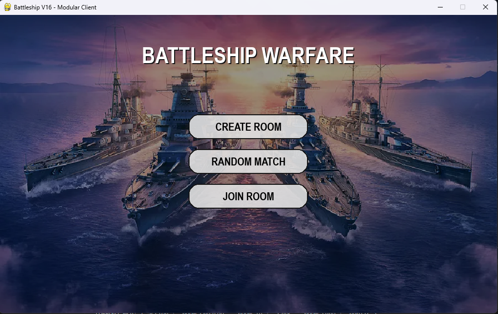
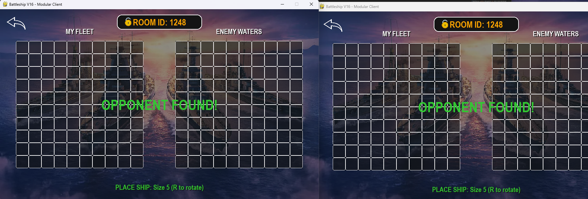
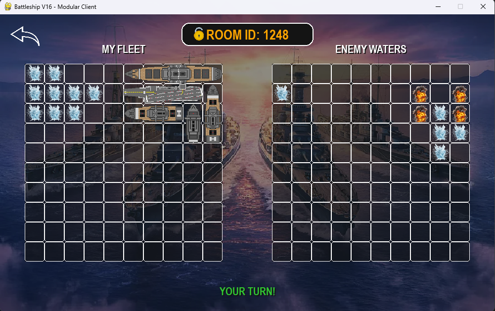
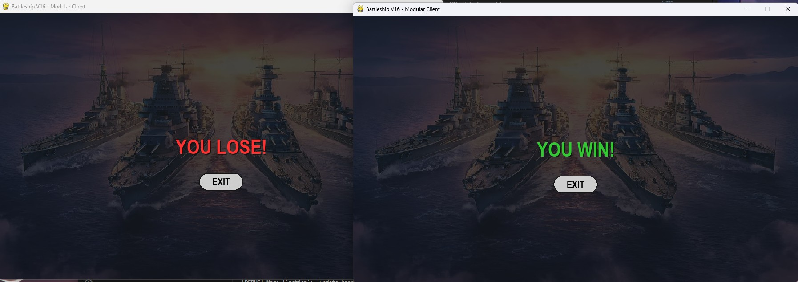

```markdown
# 🚢 Đại Chiến Hạm Đội (Battleship Warfare)


Một tựa game bắn tàu (Battleship) nhiều người chơi theo thời gian thực (Real-time Multiplayer), được xây dựng bằng **Python** và **Pygame**, sử dụng kỹ thuật lập trình mạng **Socket**. Dự án được tái cấu trúc (Refactor) theo mô hình Client-Server hiện đại, chia nhỏ module để dễ dàng quản lý và phát triển.

---

## 🚀 Tính Năng Nổi Bật

* **Kiến trúc Client-Server:** Server tập trung xử lý logic, quản lý nhiều phòng chơi cùng lúc.
* **Giao thức mạng ổn định:** Sử dụng TCP Socket với cơ chế đóng gói tin tùy chỉnh (Header 4 bytes) để đảm bảo dữ liệu không bị dính hoặc mất.
* **Hệ thống phòng chơi (Room System):**
    * **Tạo phòng (Create):** Tạo phòng riêng tư với Mã phòng (Room ID).
    * **Vào phòng (Join):** Nhập ID để vào chơi với bạn bè.
    * **Ghép ngẫu nhiên (Random Match):** Tự động tìm đối thủ đang chờ.
* **Lối chơi (Gameplay):**
    * Sắp xếp đội hình tàu (Hỗ trợ xoay tàu dọc/ngang với phím `R`).
    * Cơ chế bắn theo lượt (Turn-based).
    * Cập nhật trạng thái trúng/trượt/chìm tàu theo thời gian thực.
    * Tự động xử lý khi đối thủ thoát đột ngột (Disconnect handling).

---

## 📸 Hình Ảnh Minh Họa (Screenshots)

### 🖥️ Giao diện chính & Phòng chờ
| Menu Chính | Tạo Phòng Riêng Tư |
| :---: | :---: |
|  |  |

### ⚔️ Gameplay & Trận đấu
| Tìm Thấy Trận | Giao Diện Chiến Đấu |
| :---: | :---: |
|  |  |

### 🏆 Kết thúc
| Kết Quả Thắng/Thua |
| :---: |
|  |

---

## 📂 Cấu Trúc Dự Án

Dự án được tổ chức theo mô hình module hóa chuyên nghiệp:

```text
ltm/
├── client/                 # Thư mục chứa mã nguồn client
│   ├── __init__.py         # Khởi tạo package
│   ├── main.py             # File chạy chính (Vòng lặp game)
│   ├── ui.py               # Xử lý giao diện, hình ảnh, vẽ màn hình
│   ├── network.py          # Xử lý kết nối socket client
│   ├── game_logic.py       # Luật chơi, class tàu, check thắng thua
│   ├── constants.py        # Cấu hình (Màu sắc, ip server, kích thước)
│   └── assets/             # Tài nguyên (Ảnh tàu, nền, icon)
├── docs/                   # Tài liệu & hình ảnh minh chứng (screenshots)
├── server.py               # Mã nguồn server (Chạy độc lập)
├── requirements.txt        # Danh sách thư viện cần thiết
└── readme.md               # Tài liệu hướng dẫn sử dụng

```

---

## 🛠️ Cài Đặt

### 1. Yêu cầu hệ thống

* Máy tính đã cài đặt Python 3.10 trở lên.

### 2. Cài đặt thư viện

Bạn cần cài thư viện `pygame` để chạy client:

```bash
pip install pygame

```

---

## 🎮 Hướng Dẫn Chạy (Quan Trọng)

**LƯU Ý:** Luôn mở terminal tại **thư mục gốc** của dự án (thư mục `ltm`, nơi chứa file `server.py`).

### Bước 1: Khởi động Server

Mở một terminal và chạy lệnh:

```bash
python server.py

```

*Server sẽ bắt đầu lắng nghe tại `127.0.0.1:65432`.*

### Bước 2: Khởi động Client (Người chơi)

Mở một terminal mới (cho người chơi 1) và chạy lệnh:

```bash
python -m client.main

```

> **⚠️ CẢNH BÁO:** Tuyệt đối **KHÔNG** chạy lệnh `python client/main.py`. Điều này sẽ gây lỗi `ImportError`. Bạn bắt buộc phải đứng ở thư mục gốc và dùng cờ `-m` để chạy như một module.

---

## 🕹️ Cách Điều Khiển

* **Chuột:** Click để đặt tàu và chọn ô bắn trên bàn cờ đối thủ.
* **Bàn phím:**
* Phím **R**: Xoay tàu (Ngang/Dọc) trong giai đoạn xếp tàu.
* Phím **Backspace**: Xóa ký tự khi nhập mã ID phòng.
* Phím **Enter**: Xác nhận tham gia phòng chơi.


---

## 👥 Phân Công Nhóm

| Vai Trò | Trách Nhiệm Chính | Thành Viên |
| --- | --- | --- |
| **Trưởng Nhóm** | Quản lý cấu trúc, ghép code (`main.py`), xử lý luồng game. | **Lê Hoàng Phúc** |
| **Giao Diện** | Thiết kế giao diện (`ui.py`), xử lý hình ảnh (`assets`). | **Nguyễn Quốc An** |
| **Mạng** | Xử lý socket (`network.py`), logic server (`server.py`). | **Huỳnh Minh Quân** |
| **Logic** | Xử lý luật chơi (`game_logic.py`), thuật toán check tàu. | **Bùi Văn Ý** |

---

## 📜 Bản Quyền

Dự án được thực hiện nhằm mục đích học tập cho môn học Lập trình mạng.

```

```